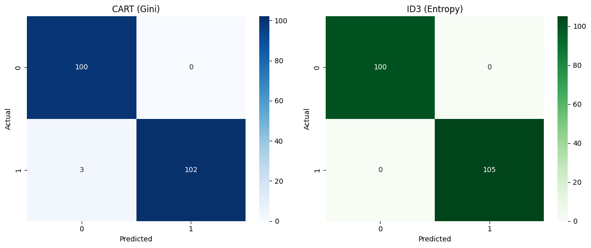
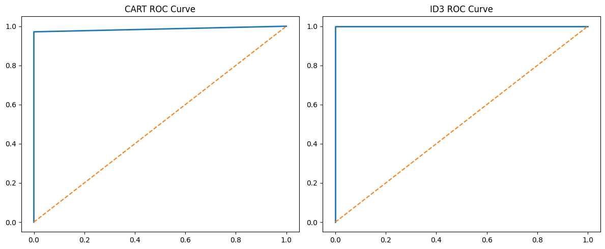
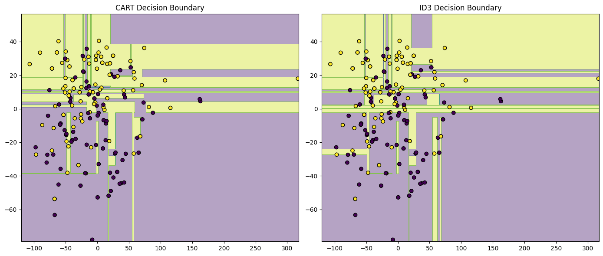
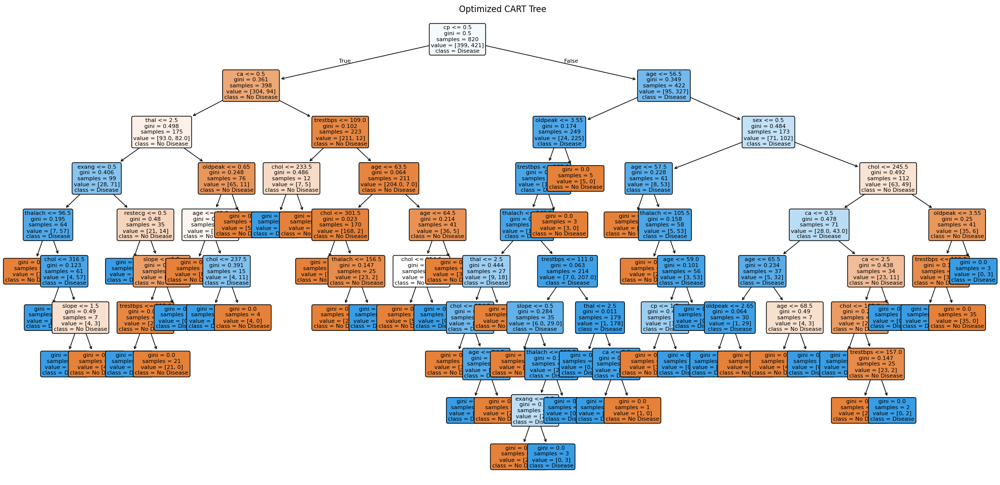
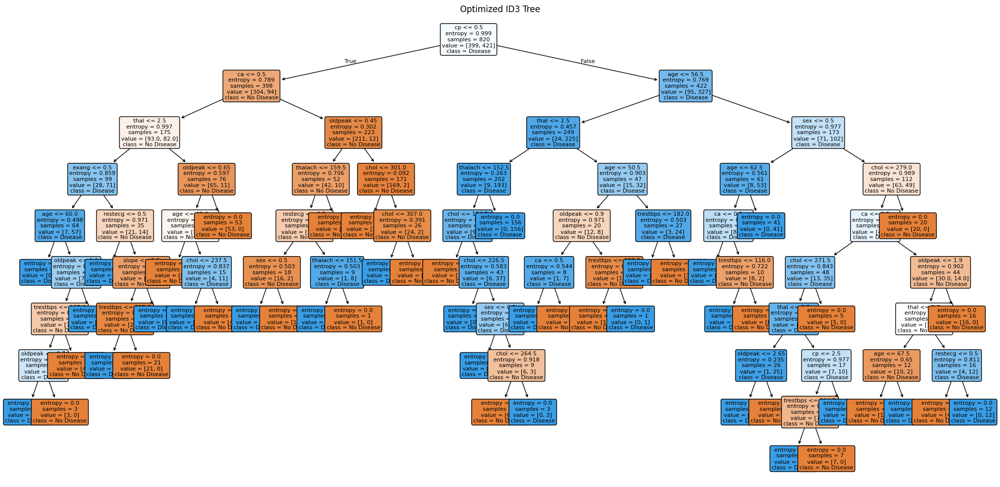

# Decision Tree (DT) Implementation and Comparison

## Overview

This project implements and compares two Decision Tree algorithms:

* CART (Gini Index)
* ID3 (Entropy)

The workflow is fully automated using Google Colab and GitHub. The dataset is loaded directly from a GitHub Raw URL without manual upload.

---

## Dataset

Heart Disease Dataset

Target Variable:

* `target`

Dataset is automatically loaded from GitHub during notebook execution.

---

## Workflow

### Data Preprocessing

* Missing value handling
* Categorical feature encoding

### CART Model

* DecisionTreeClassifier
* Criterion: Gini
* Hyperparameter tuning using GridSearchCV

### ID3 Model

* DecisionTreeClassifier
* Criterion: Entropy
* Hyperparameter tuning using GridSearchCV

---

## Best Hyperparameters

### CART

* max_depth = 10
* min_samples_split = 2

### ID3

* max_depth = 10
* min_samples_split = 2

---

## Performance Results

| Metric    | CART   | ID3  |
| --------- | ------ | ---- |
| Accuracy  | 98.54% | 100% |
| Precision | 100%   | 100% |
| Recall    | 97.14% | 100% |
| F1 Score  | 98.55% | 100% |
| AUC       | 98.57% | 100% |

---

## Confusion Matrix

---

## ROC Curve

---

## Decision Boundary Comparison

---

## Performance Comparison

---

## Optimized CART Tree

---

## Optimized ID3 Tree

---

## Files

* `220125_DT.ipynb` → Complete Colab notebook
* `heart.csv` → Dataset
* `README.md` → Project documentation

---

## Repository

The notebook can be executed directly in Google Colab. Running all cells automatically downloads the dataset, trains both models, and generates all required visualizations.
